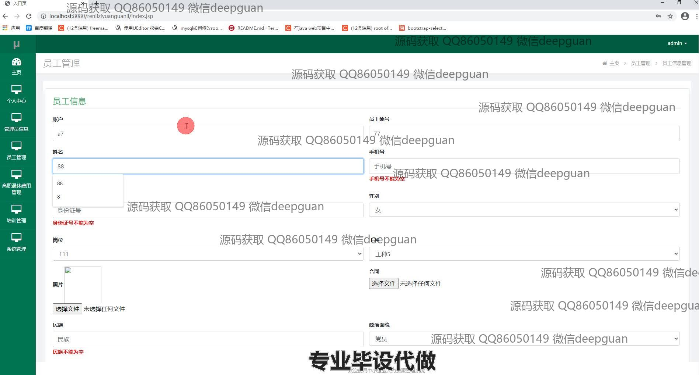
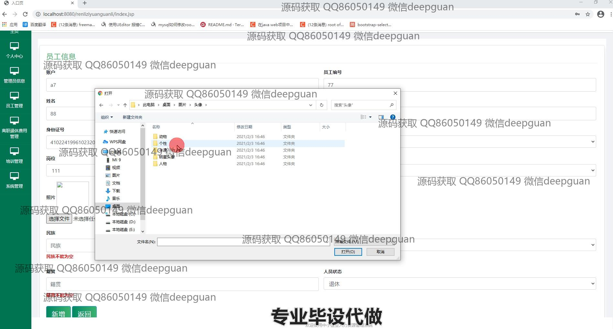
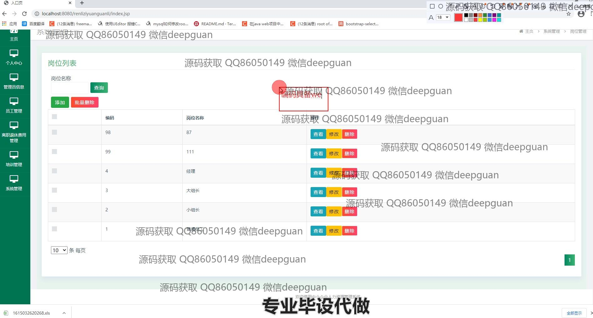
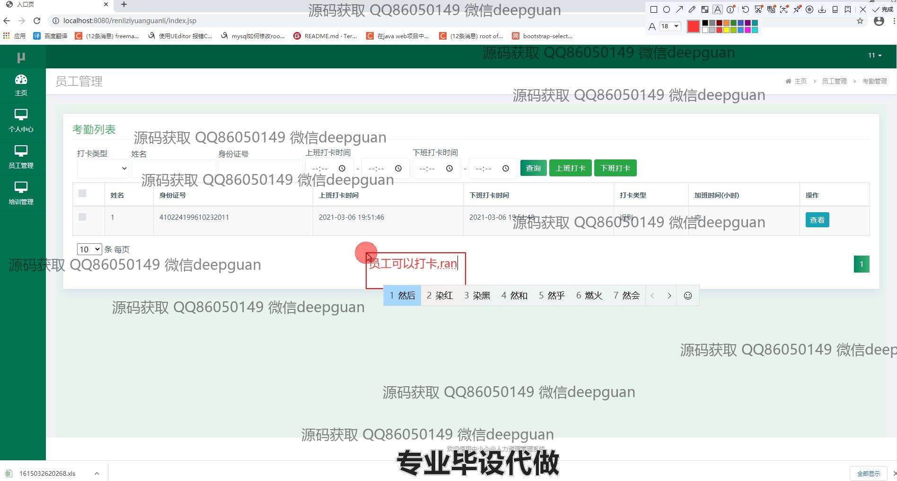
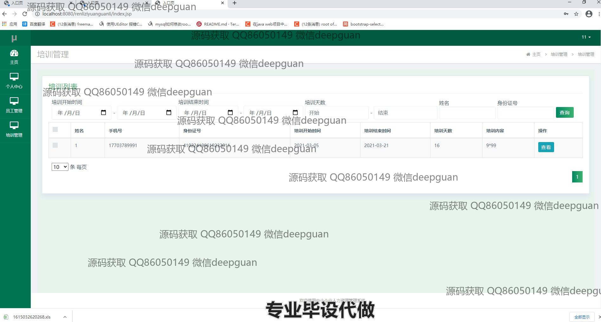

<h1 align="center">基于spring框架的中小企业人力资源管理系统</h1>

## 简介
基于Spring框架的人力资源管理系统，角色包括管理员和用户；提供员工信息管理、考勤管理、工资管理、培训管理、绩效管理等功能，旨在提高中小企业的人力资源管理效率。    --计算机毕业设计源码；毕设源码；java毕业设计源码

## 联系方式

<h3 align="center">获取完整代码与数据库文件 + 微信：deepguan QQ: 86050149 QQ群: 783742310</h3>

<h3 align="center">可帮忙远程部署 包运行成功！提供远程部署、修改代码、设计文档指导、代码讲解等服务！</h3>

## 功能介绍（完整见运行截图）
管理员：登录与注册权限，管理企业主页与导航模块，包括员工管理、培训管理和考勤管理等。处理员工信息与操作权限，管理数据库表，如用户信息表，规划系统模块化结构，通过导航栏进入不同管理功能模块。主要负责岗位管理与工资管理模块，管理员工信息的录入和修改，并支持查看、修改和删除员工考勤记录及工资信息。可执行批量删除操作，支持对员工绩效和奖惩信息管理。

用户：拥有基础的登录、注册和个人信息管理权限。可通过系统主页与导航菜单访问个人中心、员工信息录入管理、培训与考勤等模块。填写和更新个人及岗位相关信息，通过界面对员工信息进行增加、修改和查询操作。查看个人工资信息与考勤记录，进行日常打卡操作，实现工种与合同信息的查询和管理。สามารถ参与培训计划的管理及人员信息的批量操作，提升日常管理的便捷性。

## 运行截图

本代码来源于网络,仅供学习参考使用!

